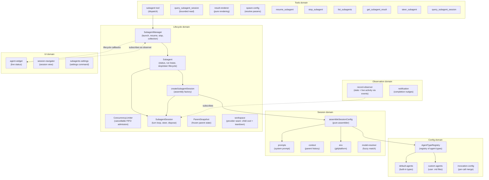
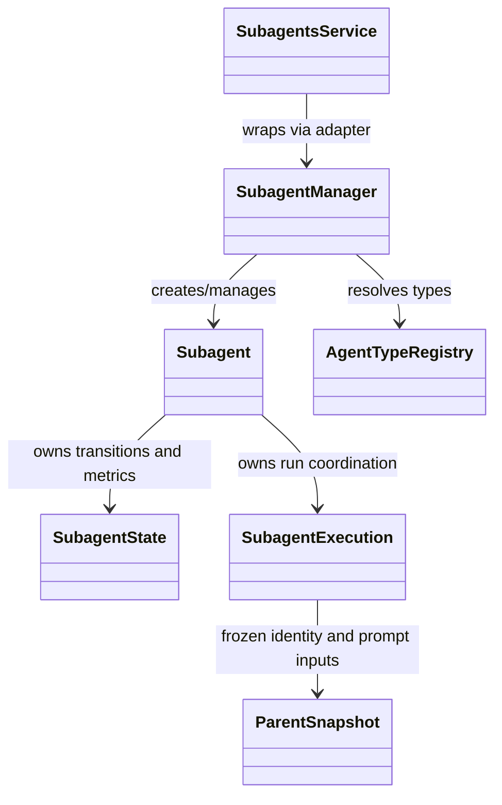
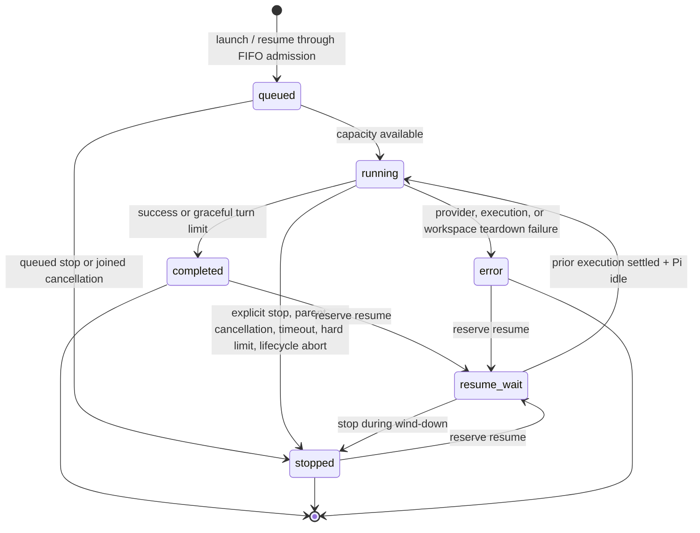
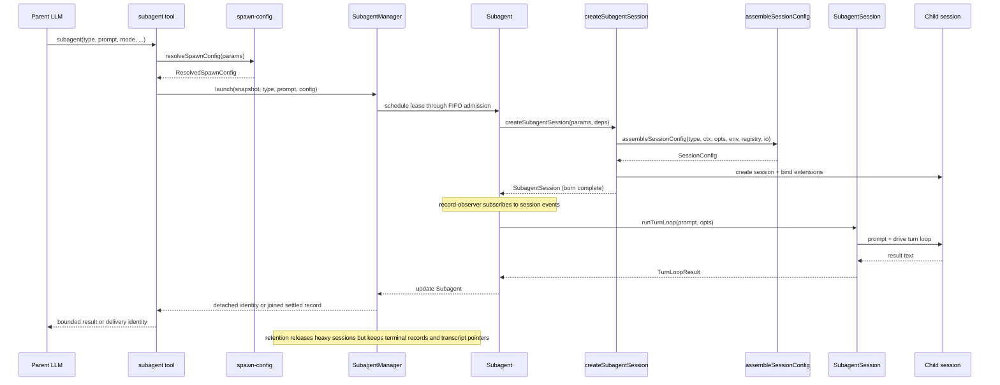
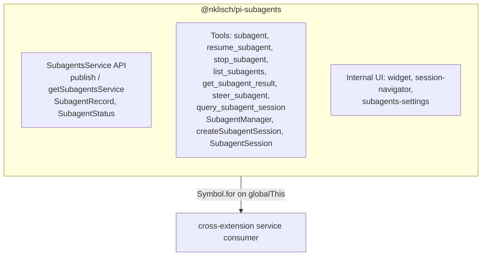

# Architecture

This document describes the architecture of `@nklisch/pi-subagents`: a focused, composable core with a stable API boundary that other extensions can build on. A subagent is a child Pi session. Joined delivery returns its settled result through the calling tool; detached delivery returns an identity while the child continues running.

## Design principles

1. **Narrow core** — the extension owns agent spawning, execution, and result retrieval.
   Everything else is a consumer.
2. **Composable by default** — other extensions can spawn agents, observe their lifecycle, and display their state without importing this package directly.
3. **Typed API boundary** — this package exports a `SubagentsService` interface and `Symbol.for()` accessors (`publishSubagentsService` / `getSubagentsService`).
   Consumers declare this package as an optional peer dependency and use dynamic import for compile-time types.
   The runtime bridge is `Symbol.for("@nklisch/pi-subagents:service")` on `globalThis` — no separate API package.
4. **No time-based scheduling** — cron-style timed dispatch stays outside the core.
   Timed dispatch is a separate concern that any extension can implement by calling `launch()` on the published API.
   The max-concurrent admission gate is not scheduling in this sense — concurrency management stays in core.
5. **UI is an in-core, substitutable consumer** — [ADR-0004](../decisions/0004-reconsider-ui-direction.md) records the per-component decision: the widget shows detached agents only, native session navigation provides read-only transcripts, settings have a focused command, and the UI stays in the core as a reactive consumer (not extracted to a separate package).
   Extraction remains an available future option because the composition invariant holds — the core is byte-for-byte identical with or without a given UI consumer.
6. **Snapshot identity; share the canonical runtime** — mutable parent identity and prompt state are frozen into `ParentSnapshot` at spawn. The parent `ModelRuntime` is deliberately shared so child sessions preserve runtime provider and authentication registrations; no live session context is captured.
7. **Subscribe, don't thread** — observation of agent progress uses direct session-event subscription, not callback parameters threaded through multiple layers.
8. **Construct complete** — objects are born with all their dependencies.
   If state isn't available yet, the object that needs it doesn't exist yet.
   No post-construction field writes from external code — if an object can't be instantiated ready-to-go, the prep work hasn't been done and the right dependencies haven't been identified.
9. **State owns its mutations** — mutable state lives in a class whose methods enforce valid transitions and invariants.
   Classes encapsulate the state they manage rather than exposing module-scoped variables or mutable shared interfaces to external writers.
10. **Open for extension, closed for modification** — pi-subagents is a minimal core that publishes events and a service API.
    Other packages (pi-permission-system, a future UI extension, hypothetical OTel integration) hook into these events to add permissions, rendering, or telemetry.
    Pi-subagents has zero knowledge of its consumers — dependency arrows point inward, never outward.

## Domain model

The extension is organized around six domains, each responsible for one aspect of managing agents.



### Key domain types



## Agent lifecycle



Note: `markStopped` always succeeds regardless of current status.
Other terminal transitions guard against overwriting `stopped` — once an agent is stopped, only an admitted resume can return it to `running`.

Resume admission is a record-owned lease. A genuinely running or already-reserved record rejects a second resume before reaching Pi. A stopped record may still own a winding-down prompt, and Pi may still be finishing post-run continuation after the domain result looks terminal; the lease therefore spans the prior execution promise and Pi's authoritative `agent_settled`/`isIdle` boundary. Retention, abort, result waiting, and manager shutdown all treat the lease as active.

Terminal outcomes also carry orthogonal consumption state. Joined delivery, `get_subagent_result`, and a queued detached completion notification mark the outcome consumed. Records remain available for the parent session; only their heavy live child sessions are released after the configured consumed or unconsumed retention window. Released records keep their result and persisted transcript pointer but cannot resume. Release detaches the session synchronously before awaiting teardown, so it cannot race a new resume.

Completion notifications are held while the parent agent run is active and flushed on `agent_settled`, rechecking consumption before enqueueing a follow-up. `get_subagent_result` is a bounded, nonblocking read: active runs return status; terminal results are marked consumed so a later completion nudge does not duplicate delivery. Child session creation shares the parent model runtime and leaves extension-tool registration open; a denylist removes disallowed built-ins and recursive orchestration tools across registry refreshes. Child teardown mirrors Pi's managed root lifecycle: it emits and awaits `session_shutdown` before `AgentSession.dispose()` revokes extension contexts, then publishes the child `disposed` event.

## Execution flow



## Module organization

The source separates domain logic from entry-point wiring in these directories: `config/`, `session/`, `lifecycle/`, `observation/`, `service/`, `tools/`, `ui/`, and `handlers/`.

### Current layout

```text
src/
├── index.ts                        entry point, tool registration, event wiring
├── runtime.ts                      SubagentRuntime factory (session-scoped state)
├── types.ts                        shared type definitions
├── settings.ts                     SettingsManager (persistent operational settings)
├── debug.ts                        debug logging utility
├── layered-settings.ts             loadLayeredSettings helper (published as @nklisch/pi-subagents/settings)
│
├── config/                         agent type definitions and resolution
│   ├── agent-types.ts              AgentTypeRegistry class
│   ├── default-agents.ts           built-in agent configs (general-purpose, Explore)
│   ├── custom-agents.ts            user-defined agent .md file loader
│   └── invocation-config.ts        per-call config merge
│
├── session/                        session assembly and preparation
│   ├── session-config.ts           pure assembler (main entry)
│   ├── prompts.ts                  system prompt building
│   ├── content-items.ts            shared message content parsing (tool-call names, assistant content)
│   ├── context.ts                  parent conversation extraction
│   ├── query.ts                     bounded live/file transcript projection and search
│   ├── query-source.ts              shared JSONL adapter for query and native navigation
│   ├── conversation.ts             render a session's messages as formatted text
│   ├── env.ts                      git/platform detection
│   ├── model-resolver.ts           fuzzy model name resolution
│   └── session-dir.ts              session directory derivation
│
├── lifecycle/                      agent execution and state tracking
│   ├── subagent-manager.ts         collection manager + observer wiring
│   ├── create-subagent-session.ts  assembly factory: session creation, binding, tool filtering
│   ├── subagent-session.ts         born-complete child session: turn loop, steer, dispose
│   ├── turn-limits.ts              normalizeMaxTurns (turn-count policy)
│   ├── subagent.ts                 authoritative run lease and stop/resume lifecycle
│   ├── subagent-state.ts           coarse status, terminal reasons, and metrics
│   ├── run-listeners.ts            per-run observer-unsubscribe handle
│   ├── workspace-bracket.ts        child workspace prepare/dispose lifecycle
│   ├── concurrency-limiter.ts      cancellable FIFO admission gate for all run modes
│   ├── parent-snapshot.ts          immutable spawn-time parent state
│   ├── child-lifecycle.ts          child-execution lifecycle event publisher
│   ├── workspace.ts                workspace provider seam (generative extension surface)
│   └── usage.ts                    token usage tracking
│
├── observation/                    progress tracking and notification
│   ├── record-observer.ts          session-event stats observer
│   ├── notification.ts             completion nudges + per-agent consumed-result tracking
│   ├── renderer.ts                 notification TUI component
│   ├── composite-subagent-observer.ts fans manager notifications out to multiple observers
│   └── subagent-events-observer.ts manager lifecycle observer (event emission + persistence + notification)
│
├── service/                        cross-extension API boundary
│   ├── service.ts                  SubagentsService interface + Symbol.for() accessors
│   └── service-adapter.ts          SubagentsServiceAdapter class wrapping SubagentManager
│
├── tools/                          LLM-facing tool implementations
│   ├── agent-tool.ts               subagent tool definition, validation, dispatch
│   ├── result-renderer.ts          pure per-status result rendering
│   ├── spawn-config.ts             pure config resolution
│   ├── resume-tool.ts              resume_subagent tool
│   ├── stop-tool.ts                stop_subagent tool
│   ├── list-tool.ts                list_subagents tool
│   ├── get-result-tool.ts          get_subagent_result tool
│   ├── query-session-tool.ts       query_subagent_session tool
│   ├── parent-tool-registry.ts     authoritative parent-only tool names
│   ├── steer-tool.ts               steer_subagent tool
│   └── helpers.ts                  shared tool utilities
│
├── ui/                             user-facing presentation
│   ├── agent-widget.ts             above-editor live status widget
│   ├── widget-renderer.ts          pure rendering for widget
│   ├── display.ts                  pure formatters and shared types
│   ├── subagents-settings.ts       /subagents:settings command handler
│   ├── session-navigation.ts       pure session-selection and transcript-source logic
│   └── session-navigator.ts        /subagents:sessions command handler and search overlay
│
└── handlers/                       event handlers
    ├── index.ts                    barrel re-export
    ├── interrupt.ts                turn_start handler — abort all subagents on parent interrupt (ESC)
    ├── lifecycle.ts                session_start, session_before_switch, session_shutdown
    └── tool-start.ts               tool_execution_start handler
```

### Transcript query boundary

`query_subagent_session` is a parent-only, read-only pull surface. Its pure
`session/query.ts` projection correlates tool results to calls, searches every
complete visible field with literal case-insensitive matching, and returns
match-centered bounded excerpts with source-range metadata. Tool names and call
IDs remain complete only in the projection-local search/correlation data;
returned display values are bounded while stable entry IDs remain intact for the
overlay. Scope, ordering, 1–50 result limits, and stateless numeric offsets page
the ordered matching set; byte and line output bounds may shorten a page without
advancing beyond entries actually returned, but a non-empty page always emits a
bounded first entry. It reads a live child session when retained and otherwise
uses the same Pi JSONL/context adapter as native session navigation. No index,
cursor, or query state is persisted, and successful reads report complete
search rather than a partial-search state.

`/subagents:sessions` keeps Pi's native message, markdown, and tool-execution
components for the transcript body. Its overlay owns only ephemeral search
state and block-level match chrome; a release notification swaps the source to
the file snapshot, while an unavailable snapshot preserves the last readable
content and labels the degraded state.

### Observation model

Record statistics (tool uses, token usage, compaction counts) and live activity (active tools, response text, turn counts) are updated by `record-observer.ts`, which subscribes directly to session events.
This is the single per-child session subscription — all run state lives on the `Subagent` record.

The widget maintains a bounded reactive read model of active detached records and the small terminal linger set, populated by `SubagentManagerObserver` lifecycle callbacks. While active it refreshes that model at 500 ms; each refresh reads only those retained records and requests the normal Pi widget render, rather than cloning or sorting the manager's full terminal history. When only terminal linger records remain, it renders the completion state once and leaves the static widget registered without an interval until turn aging or clear removes it. The `/subagents:sessions` navigator reads messages via `Subagent.agentMessages`, falls back to the retained JSONL source after release, and subscribes to both session and record-release updates — no direct `AgentSession` reference.

## Cross-extension architecture



Consumers call `getSubagentsService()?.launch(...)` at runtime.
They declare this package as an optional peer dependency and use dynamic import for compile-time types.

### What the core owns

- The parent-only tools: `subagent`, `resume_subagent`, `stop_subagent`, `list_subagents`, `get_subagent_result`, `steer_subagent`, and `query_subagent_session`.
- `SubagentManager` — launch, resume, cooperative stop, collection management, and observer wiring.
- `ConcurrencyLimiter` — cancellable FIFO admission gate shared by joined and detached runs.
- `createSubagentSession` — assembly factory: session creation and extension binding; returns a born-complete `SubagentSession`.
- `SubagentSession` — the born-complete child session: drives turn loops, exposes Pi's idle boundary, steers, and performs idempotent asynchronous teardown (`session_shutdown` → `AgentSession.dispose()` → child `disposed`).
- `child-lifecycle` — publishes the child-execution lifecycle (`spawning`, `session-created` before `bindExtensions()`, `completed`, `disposed`) on `pi.events`.
  A permission consumer can register each child session on `session-created` and unregister it on `disposed`.
  The core does not look up a named consumer; see [ADR-0002].
- `workspace` — the workspace provider seam ([ADR-0002]): a registered `WorkspaceProvider` supplies a child's cwd plus bracketed `dispose()` at run-start.
  With no provider, children run in the parent cwd; a companion package can supply a Git worktree strategy behind this seam.
- `session-config` — pure configuration assembler (called by `createSubagentSession`).
- `SubagentRuntime` — session-scoped state bag with methods.
- `ParentSnapshot` — immutable snapshot of parent session state, captured once at spawn time.
- `record-observer` — session-event observer that updates record statistics without callback threading.
- Agent type registry — default agents, custom `.md` file loading.
- Prompt assembly, context extraction, skills, environment.
- Worktree isolation is an external workspace-provider strategy, not a core responsibility ([ADR-0002]).
- Token usage tracking.
- Session directory derivation and persisted `SessionManager` for subagent transcripts.
- Settings persistence.
- Internal UI (widget, `/subagents:sessions` session navigator, `/subagents:settings` command) is a substitutable consumer ([ADR-0004]).

### What stays outside the core

Time-based scheduling, event RPC, batch/group identity, hard process termination,
and agent-definition editors are not core responsibilities. Permission policy and
workspace strategies belong to companion extensions. The core retains its own
parent-only tool guard and supported tool-denylist behavior; these are not a
second permission system.

## SubagentsService

The `SubagentsService` interface, accessor functions, and serializable types are exported from `@nklisch/pi-subagents` via the root export.
No separate API package is needed. The service adapter resolves caller-supplied
model strings against the active registry before launch.

Consumers declare this package as an optional peer dependency:

```json
{
  "peerDependencies": {
    "@nklisch/pi-subagents": ">=18.0.0"
  },
  "peerDependenciesMeta": {
    "@nklisch/pi-subagents": { "optional": true }
  }
}
```

At runtime, consumers use dynamic import for type-safe access to the accessor functions:

```typescript
const { getSubagentsService } = await import("@nklisch/pi-subagents");
const svc = getSubagentsService();
if (svc) {
  void svc.launch("Explore", "Check for stale TODOs", { mode: "detached" });
}
```

Pi's extension loader creates a fresh `jiti` instance per extension with `moduleCache: false`, so module-scoped singletons don't survive across extensions.
The accessor functions use `Symbol.for("@nklisch/pi-subagents:service")` on `globalThis`, which is process-global by spec, to bridge this gap.
The dynamic import provides compile-time types; the `Symbol.for()` key is the actual runtime channel.

### Interface

See `src/service/service.ts` for the canonical definition.
Key types:

- `SubagentsService` — `launch`, `resume`, `stop`, `steer`, `list`, `getResult`, `getRecord`, `waitForAll`, and `hasRunning`.
- `SubagentRecord` — serializable agent snapshot with run id, mode, status, terminal reason, active runtime, model, and thinking level.
- `LaunchOptions` — `description`, `model`, `maxTurns`, `thinkingLevel`, `inheritContext`, `mode`, `timeoutSeconds`, and `signal`.
- `SUBAGENT_EVENTS` — channel constants for `pi.events` subscriptions.

### Lifecycle events

The core emits events on `pi.events` that any extension can observe:

| Channel | Meaning |
| --- | --- |
| `subagents:started` | Agent begins running. |
| `subagents:completed` | Agent reaches a terminal state. |
| `subagents:resumed` | A retained session's resumed turn finishes. |
| `subagents:failed` | Agent ends in error or stopped state. |
| `subagents:compacted` | Child session compacts. |
| `subagents:created` | Agent record exists before admission. |
| `subagents:steered` | A steering message reaches a running agent. |

The event names are defined in `src/service/service.ts`; the lifecycle observer
and child-lifecycle publisher own payload construction. Consumers should use
those code-owned contracts rather than a separately maintained payload schema.

These are fire-and-forget broadcast events — no request IDs, no reply channels.

## Extension composition

The core owns child-session orchestration. Companion extensions attach through
lifecycle observation or a concrete provider seam, rather than reaching into
`SubagentManager` or making the core look up a named consumer.

### Observation and providers

- Child-execution lifecycle publication exposes spawning, pre-bind session
  creation, completion, and disposal to consumers. Session creation is published
  before extension binding so a companion can identify the child at that boundary.
- Agent lifecycle broadcasts report immutable event data. They are notifications,
  not prompt or result replacement APIs.
- A workspace provider supplies the child's working directory and bracketed
  cleanup. With no provider, the child runs in the parent's working directory.
- Ordered lifecycle interceptors can replace prompts or candidate results, abort a
  turn, or request bounded same-session continuation. Registration order,
  cancellation, failure, and disposal follow [ADR-0005].

The governing rule is **no vacant hooks**: admit a seam in the design, but ship it
only when a concrete consumer needs it. Permissions and workspace strategies
compose independently; the core depends on neither implementation.

### State, queries, and behavior

Run state has one owner. Observers accumulate statistics and activity from the
child session; tools and UI read the resulting state rather than counting again.
Reactive UI keeps its own bounded read model. Discrete questions—status, results,
and transcript queries—remain bounded pull operations. Steering and stop requests
are behaviors whose owner checks whether the transition is valid, not a sequence
of caller-side status checks followed by external mutation.

Mutable parent identity and prompt inputs are frozen before admission. The
canonical parent model/authentication runtime is shared deliberately, preserving
runtime registrations without retaining a live session context. Cleanup is owned
at resource boundaries, and a queued run has an awaitable settlement even before
its concurrency slot opens.

### Engineering boundaries

The entry point constructs collaborators and binds Pi APIs. Domain modules receive
explicit dependencies; environment discovery and session-factory I/O are separate
boundaries so tests can drive real behavior without module-mocking choreography.
Rendering helpers consume values, while Pi-specific components own terminal
integration. Shared test setup may be extracted, but the operation under test
stays visible rather than hidden merely to reduce duplication metrics.

The root service and `./settings` are public package exports. Type declarations
are generated and bundled independently of the shipped TypeScript runtime source;
[ADR-0003] owns that packaging decision. Public interfaces and durable user data
carry compatibility obligations; internal structures remain code-owned.

## Fork ownership

`@nklisch/pi-subagents` is maintained in the `nklisch/pi-extensions` monorepo.
[Fork maintenance](../FORK-MAINTENANCE.md) owns provenance, release policy, and the
upstream relationship. [Comparison with upstream](../comparison-with-upstream.md)
explains the product boundary; upstream ideas are not automatic parity work.

[ADR-0002]: ../decisions/0002-extensions-on-a-minimal-core.md
[ADR-0003]: ../decisions/0003-publish-bundled-type-declarations.md
[ADR-0004]: ../decisions/0004-reconsider-ui-direction.md
[ADR-0005]: ../decisions/0005-ordered-lifecycle-interceptors.md
